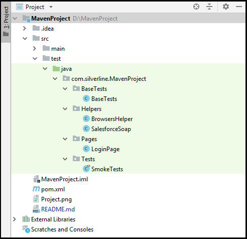
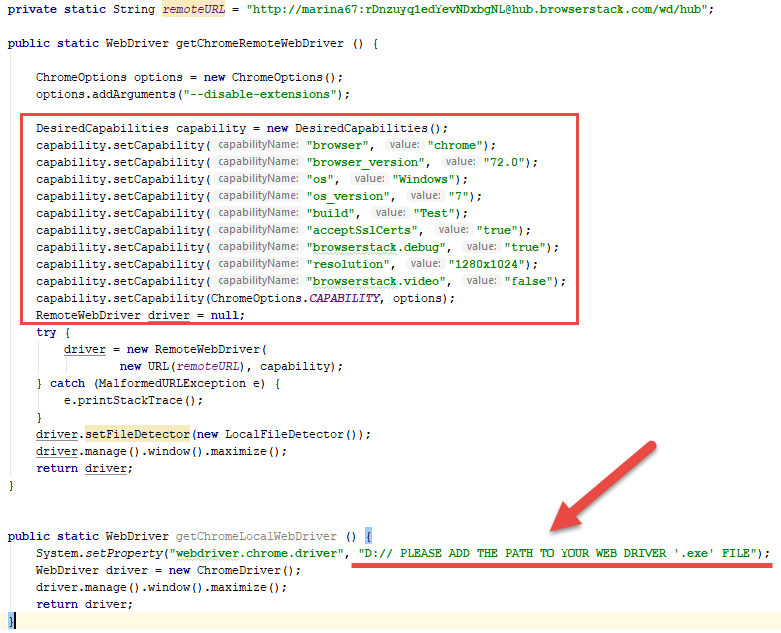

# Maven Project
This guide will help you to setup and start to use your new project with tests.

## Content: 

- **1. A few words about the project**

- **2. Packages:**
    * 'BaseTests' package;
    * 'Helpers' package;
    * 'Pages' package;
    * 'Tests' package.
    
- **3. 'QUICK START' instruction**

## 1. A few words about the project
When you open a project for the first time, on the left side, in the 'Project' block, you will be able to see the project structure. 

This is how it looks:

At the moment, the project contains a necessary minimum that will help you with a quick start.
Any package or java class can be opened by double click. More detailed information about packages and classes you can find below.  

## 2. Packages

A **"package"** is a group of Java classes. All their source files are kept in the same file system directory, and they are marked with the package keyword.

##### - 'BaseTests' package
This package contains the 'BaseTests' class, which will start WebDriver (open browser - _**'setWebDriver(BrowsersHelper.getChromeRemoteWebDriver());'**_) before each of Test Classes, and close WebDriver(close browser - _**'WebDriverRunner.getWebDriver().quit()'**_) after them.

##### - 'Helpers' package
This package contains 'BrowserHelper' and 'SalesforceSoap' classes. 
'BrowserHelper' class contains settings (capabilities) for your browsers (WebDrivers).

'SalesforceSoap' class contains methods that in the future will help us to remove test data from Salesforce by Soap API.

##### - 'Pages' package
This package contains the 'LoginPage' class. At the moment there is only one class for Login page, but you can add new classes for new pages, as needed. 
'LoginPage' class contains locators and methods for Login Page.

##### - 'Tests' package
This package contains the 'SmokeTests' class.

## 3. 'QUICK START' instruction**
Coming soon...